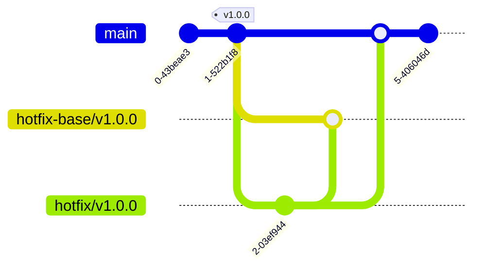

```mermaid
gitGraph
    commit
    commit tag: "v1.0.0"
    branch "hotfix-base/v1.0.0"
    branch "hotfix/v1.0.0"
    checkout "hotfix/v1.0.0"
    commit
    checkout hotfix-base/v1.0.0
    merge hotfix/v1.0.0
    checkout main
    merge hotfix/v1.0.0
    commit
```
