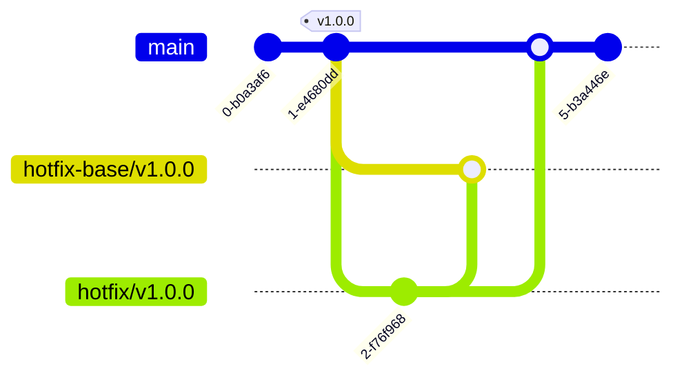

### How to Create and Merge a Hotfix in Git

This guide will walk you through the steps to create and merge a hotfix in Git. A hotfix is a quick patch to fix a critical issue in a release version of your code.

#### Create Hotfix from Tag and Push Hotfix to Remote

1. Identify the tag for the release version that needs a hotfix.
2. Create a new branch from that tag, with a name that indicates it's a hotfix branch. For example, hotfix/v1.0.0.

```bash
git checkout v1.0.0 -b hotfix/v1.0.0
```

3. Make the necessary changes to fix the critical issue.
4. Commit the changes and push the hotfix branch to the remote repository.
   > Note: Workflow will triggred on push to hotfix branch and create hotfix-base branch from the same tag and also create a pull request to merge hotfix branch to hotfix-base branch and create a pull request.

#### Ask for Approval

5. Ask for approval from the relevant stakeholders, and make any necessary changes based on their feedback.
6. Once the hotfix is approved, workflow will build and push update to deployment respository.
7. After the hotfix is deployed via push to deployment respository, **_change the base branch of the hotfix branch to the main branch_**. This will allow you to merge the hotfix branch into the main branch.
8. Merge hotfix to main branch.

#### Example



The above Git graph depicts the process for creating and merging a hotfix in Git.

The hotfix base branch should only be used to trigger the workflow for deploying the hotfix. It should not be merged into the main branch. The hotfix branch, on the other hand, contains the actual changes to fix the critical issue and should be merged into the main branch once approved.
